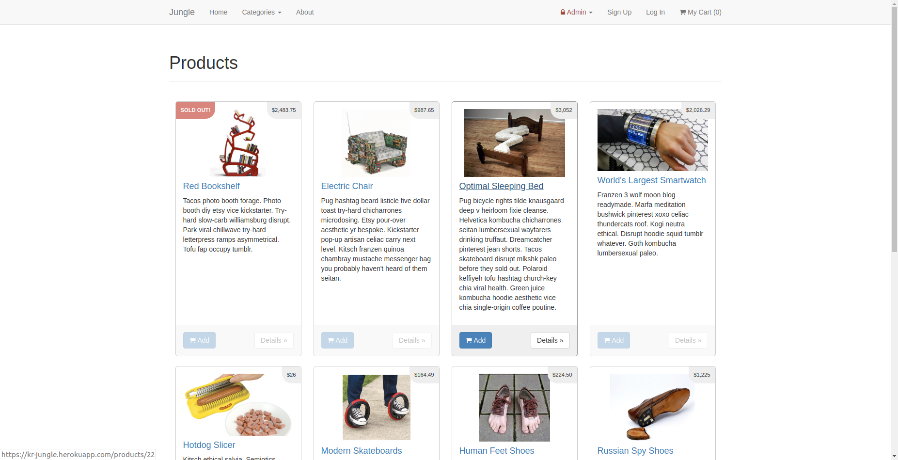
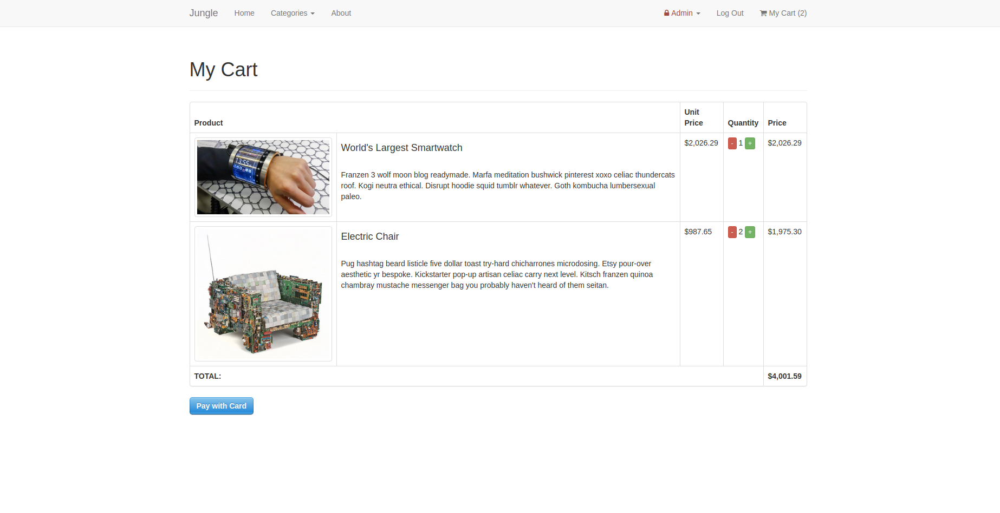
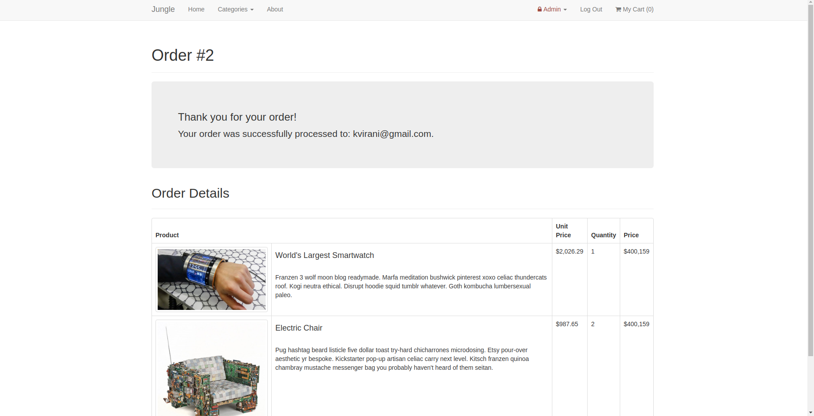
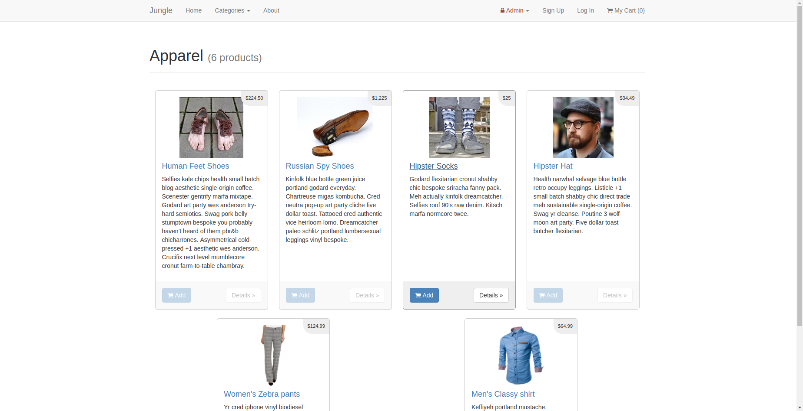

# Jungle

A mini e-commerce application built with Rails 4.2 for purposes of teaching Rails by example.

This project was an exercise in inheriting a code base and learning a new language and framework under a tight timeline. 

As part of this project, a series of features were added based on user stories, ranging from cart functionality, to adding admin categories pages, and many others. 

## Setup

1. Run `bundle install` to install dependencies
2. Create `config/database.yml` by copying `config/database.example.yml`
3. Create `config/secrets.yml` by copying `config/secrets.example.yml`
4. Run `bin/rake db:reset` to create, load and seed db
5. Create .env file based on .env.example
6. Sign up for a Stripe account
7. Put Stripe (test) keys into appropriate .env vars
8. Run `bin/rails s -b 0.0.0.0` to start the server

## Stripe Testing

Use Credit Card # 4111 1111 1111 1111 for testing success scenarios.

More information in their docs: <https://stripe.com/docs/testing#cards>

## How to Use

1. Home page on desktop for Jungle!

2. Add items and then select your cart before checking out.

3. Fill out the Stripe checkout using test credemntials to view your successful checkout!

4. Check out the categories page to view different groupings of products.

## Dependencies

* Rails 4.2 [Rails Guide](http://guides.rubyonrails.org/v4.2/)
* PostgreSQL 9.x
* Stripe
